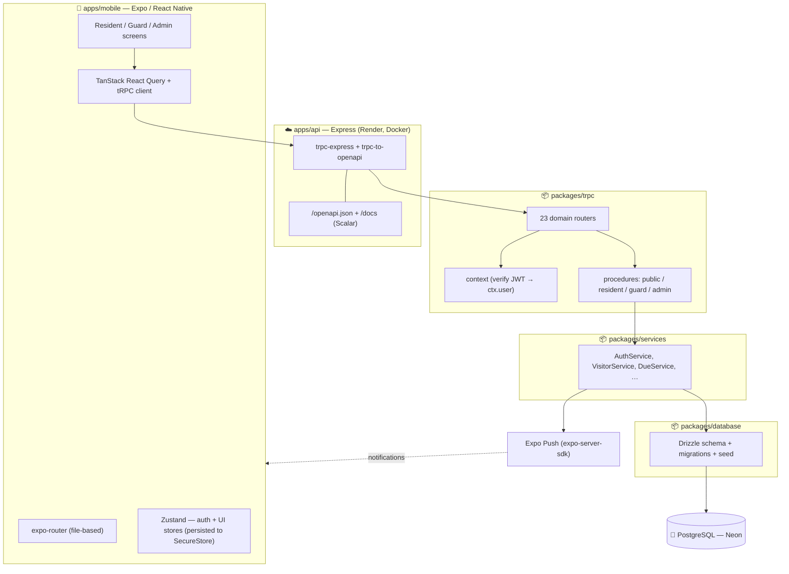
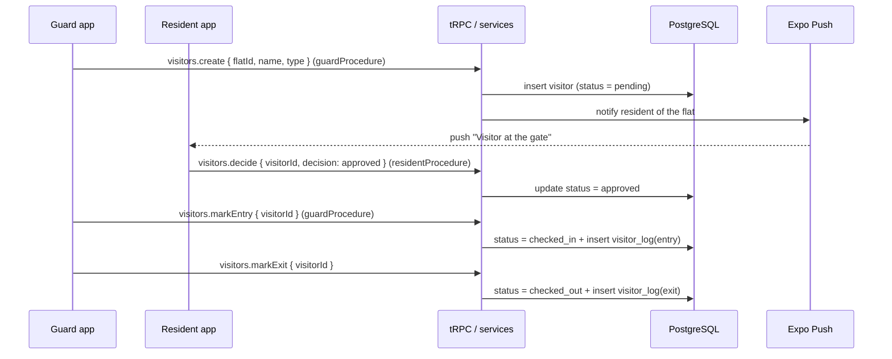
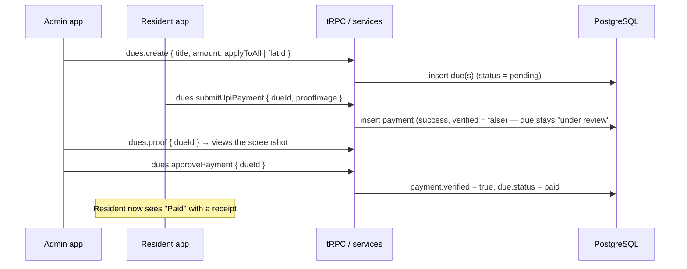

# Architecture

Portl is a **type-safe, end-to-end TypeScript monorepo** (pnpm workspaces). A single Expo/React Native app serves three roles; a thin Express server exposes a tRPC router (which also auto-generates a REST/OpenAPI surface); domain logic lives in framework-agnostic service classes; and Drizzle ORM talks to PostgreSQL.

```
apps/mobile ──tRPC/HTTPS──▶ apps/api ──▶ packages/trpc ──▶ packages/services ──▶ packages/database ──▶ PostgreSQL
   (Expo RN)                (Express)      (routers/RBAC)     (business logic)      (Drizzle schema)        (Neon)
```

---

## 1. High-level components



---

## 2. Request lifecycle

Every API call follows the same path:

1. **Client** — a screen calls `trpc.<router>.<procedure>.useQuery/useMutation()`. The tRPC client batches it over HTTPS to `/trpc`, attaching the JWT access token via a custom `fetch`.
2. **Transport** — Express hands the request to the tRPC adapter (and, for the REST surface, `trpc-to-openapi` maps a REST path to the same procedure).
3. **Context** — `createContext` reads the `Authorization: Bearer` header, verifies the JWT, and puts the decoded payload on `ctx.user` (`{ sub, role, societyId, flatId }`). Invalid/expired → `ctx.user = null`.
4. **Authorization (RBAC)** — the procedure type enforces access **on the server**:
   - `publicProcedure` — no auth.
   - `protectedProcedure` — requires `ctx.user`, else `UNAUTHORIZED`.
   - `residentProcedure` / `guardProcedure` / `adminProcedure` — require a matching `ctx.user.role`, else `FORBIDDEN`.
5. **Validation** — the procedure's Zod `input` schema parses/validates the payload; bad input → `BAD_REQUEST`.
6. **Business logic** — the router delegates to a **service** (e.g. `dueService.approvePayment(...)`). Services are plain classes with no HTTP knowledge — they own all rules and Drizzle queries, scoped to the caller's `societyId`.
7. **Side effects** — e.g. `notificationService` sends Expo push notifications.
8. **Response** — a Zod-validated `output` returns, fully typed, to React Query, which caches it.

### Token refresh
Access tokens are short-lived (15 min). The client's `fetch` wrapper intercepts a `401`, calls `auth.refresh` once (rotating the refresh token), retries the original request, and updates the Zustand auth store — transparent to the UI.

---

## 3. Sequence — Visitor approval (resident approves a guard-raised request)



## 4. Sequence — Dues payment with admin approval



---

## 5. Monorepo & type safety

| Package | Role |
|---|---|
| `apps/mobile` | Expo app (expo-router, NativeWind, Zustand, React Query) |
| `apps/api` | Express host; builds to a single self-contained bundle via `tsup` |
| `packages/trpc` | tRPC routers, `context`, role procedures; exports `ServerRouter` type + a typed client |
| `packages/services` | Domain services (one class per domain) + Zod models |
| `packages/database` | Drizzle schema, generated SQL migrations, and the seed |
| `packages/logger` | Shared logger |

**One source of truth for types:** the mobile app imports `ServerRouter` from `packages/trpc`, so every endpoint's inputs and outputs are inferred at compile time. A change to a service's Zod schema immediately surfaces as a type error in the app — no code generation, no drift, no manual API client.

---

## 6. Authentication & security

- **Passwords:** bcrypt (cost 10).
- **Tokens:** JWT access token (15 min) + opaque refresh token (30 days), hashed and stored in `refresh_tokens`, revocable and rotated on every refresh.
- **RBAC:** enforced by `requireRole` in `packages/trpc` — the server returns `FORBIDDEN`/`UNAUTHORIZED`, so access can't be bypassed by tampering with the client.
- **Multi-tenancy:** every service query is scoped to `ctx.user.societyId`; societies never see each other's data.
- **Account lifecycle:** public admin/society registration; in-app account deletion wipes credentials, releases email/phone, and revokes all sessions.

---

## 7. Push notifications

`NotificationService` uses `expo-server-sdk` to send real device notifications (approval requests, emergency alerts, chat messages). Device tokens are registered via `pushTokens.register` and stored per user; the service chunks and dispatches through Expo's push service.

---

## 8. Deployment & runtime configuration

- **Backend:** a root `Dockerfile` builds the API into a standalone Node image (tsup bundles the workspace packages), deployed on **Render**. `render.yaml` is the blueprint.
- **Database:** **Neon** managed Postgres; `DATABASE_URL` is the only DB config.
- **Mobile:** **EAS** builds the APK. `EXPO_PUBLIC_API_URL` is baked in as a fallback.
- **Remote config (no-rebuild host changes):** on launch the app resolves its backend URL from `mobile-config.json` (hosted on the repo), caches it, and the tRPC layer reads the current base at request time. Moving the backend = edit one line + push; **no new APK**. Resolution never blocks startup (falls back to cache → build-time default).

---

## 9. Key design decisions

- **tRPC over REST-by-hand** — end-to-end type safety with zero client codegen; the REST/OpenAPI surface is generated for free (great for docs and non-TS consumers).
- **Service layer separate from transport** — business rules are unit-testable and reusable; routers stay thin.
- **Server-enforced RBAC** — security doesn't depend on the UI hiding buttons.
- **Manual-UPI dues with admin approval** — realistic for Indian societies (no payment-gateway/KYC needed) while still auditable via the uploaded screenshot + a verify step.
- **Self-contained API bundle** — the container needs only Node + `dist/`, making deploys fast and host-agnostic.
