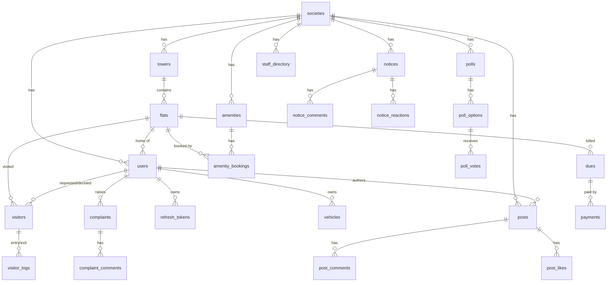

# Data Model

PostgreSQL, modelled with **Drizzle ORM** (`packages/database/models`). Everything hangs off a **society** (multi-tenant), and users belong to a society (residents also to a flat). Migrations are generated SQL in `packages/database/drizzle/`.

## Entity-relationship diagram

## Tables

| Table | Key columns | Notes |
|---|---|---|
| **societies** | name, address, city, `upi_id`, `upi_name` | Tenant root; UPI collection details |
| **towers** | society_id, name, code | e.g. Maple / A |
| **flats** | tower_id, flat_number, floor, type | e.g. A-101, 2BHK |
| **users** | full_name, email🔑, phone🔑, password_hash, `role` (resident/guard/admin), society_id, flat_id, is_active, invite_code, must_reset_password, deleted_at | Soft-deletable; email/phone unique |
| **refresh_tokens** | user_id, token_hash, expires_at, revoked_at, device_info | Rotating refresh tokens |
| **vehicles** | user_id, society_id, `type` (car/bike/other), number | Resident-owned vehicles |
| **visitors** | society_id, flat_id, name, phone, `type` (guest/delivery/cab/service/other), `source` (guard_initiated/resident_preapproved), `status`, requested_by_guard_id, decided_by_user_id, decided_at, pass_code, `keep_at_gate`, valid_from, valid_until | Full visitor lifecycle |
| **visitor_logs** | visitor_id, guard_id, `action` (entry/exit), occurred_at | Gate log |
| **notices** | society_id, author_id, title, body, `target_scope` (all/tower/flat), target_tower_id, target_flat_id, expires_at | |
| **notice_reactions** | notice_id, user_id, `reaction` (like/dislike) | unique per (notice,user) |
| **notice_comments** | notice_id, author_id, body | |
| **polls** | society_id, created_by_user_id, question, description, `multi_select`, closes_at, closed_at | |
| **poll_options** | poll_id, label | |
| **poll_votes** | poll_id, option_id, user_id | |
| **complaints** | society_id, raised_by_user_id, category, title, description, `status` (open/in_progress/resolved/closed), `priority` (low/med/high), assigned_to_user_id, resolved_at | Helpdesk |
| **complaint_comments** | complaint_id, author_id, body | |
| **amenities** | society_id, name, description, capacity, open_time, close_time, slot_minutes, is_active | |
| **amenity_bookings** | amenity_id, flat_id, booked_by_user_id, date, slot_start, slot_end, `status` (confirmed/cancelled) | |
| **dues** | flat_id, period, `title`, amount, `status` (pending/paid/overdue), due_date | |
| **payments** | due_id, amount, provider, provider_ref_id, `status` (created/success/failed), `proof_image`, `verified`, paid_at | UPI proof + admin verification |
| **staff_directory** | society_id, name, category, phone, photo_url, is_verified_by_admin, added_by_user_id | Service providers |
| **posts** | society_id, author_id, body, image_url, pinned_at | Community feed |
| **post_comments** / **post_likes** | post_id, (author/user)_id, body | likes unique per (post,user) |
| **messages** | society_id, sender_id, recipient_id, body, read_at | 1:1 chat |
| **service_requests** | user_id, flat_id, category, note, scheduled_at, status | |
| **push_tokens** | user_id, expo_push_token, device_info | For Expo push |
| **notifications** | user_id, type, title, body, data, read_at | In-app inbox |

🔑 = unique. Enums are Postgres native `pgEnum` types.

## Conventions
- **UUID** primary keys (`gen_random_uuid()`), `created_at` timestamps.
- **Scoping:** queries filter by the caller's `society_id`; residents' data additionally by `flat_id`.
- **Soft delete** on users (credentials wiped, email/phone released) preserves attribution on posts/logs.
- **Derived state** (e.g. a due being *overdue*, or *under review*) is computed at query time from status + timestamps + the latest unverified payment — not stored redundantly.
